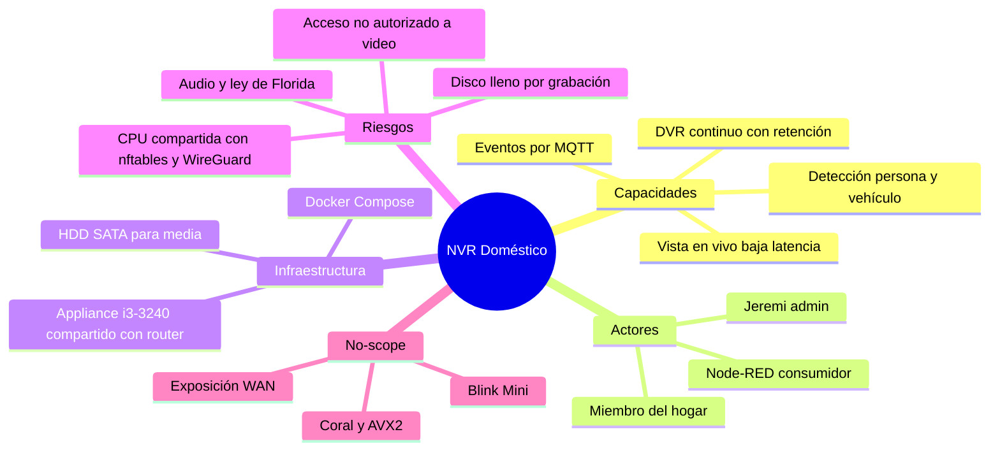

# Project Charter — NVR Doméstico Frigate

* **Estado:** draft
* **Fecha:** 2026-08-30
* **Decisores:** Jeremi
* **Fase AI-DLC:** 00-project
* **Versión:** 0.1.0
* **Sponsor:** Jeremi
* **Owner del proyecto:** Jeremi

## Visión
Concentrar la videovigilancia del hogar en un NVR local y privado (grabación DVR +
monitoreo casi en tiempo real con detección de objetos), sin dependencia de nubes de
terceros, reutilizando el appliance de red existente.

## Alcance
- Incluye:
  - Despliegue de Frigate 0.17.2 en Docker sobre el appliance (Ubuntu 24.04, i3-3240, 8 GB).
  - Integración de 2× TP-Link Tapo C310 vía RTSP (cámaras ONVIF-compatibles), con
    cuenta local de cámara y reserva DHCP en dnsmasq.
  - Grabación continua con política de retención + retención extendida de eventos.
  - Detección de objetos (persona/vehículo) por CPU sobre el sub-stream.
  - Broker MQTT (Mosquitto) para publicar eventos hacia Node-RED.
  - Aceleración de video por hardware (VAAPI / Intel HD 2500, driver i965).
  - Acceso remoto exclusivamente por el túnel WireGuard ya planificado.
- **No incluye (no-scope):**
  - Blink Mini: sin RTSP/ONVIF ni workaround mantenido (protocolo cloud propietario de
    Amazon); permanecen en la app Blink. Candidatas a reemplazo en fase posterior.
  - Exposición de ningún puerto del NVR hacia las WAN.
  - Acelerador dedicado (Coral/GPU), búsqueda semántica (el i3-3240 carece de AVX2) y
    reconocimiento facial/matrículas.
  - Integración con Home Assistant (posible ciclo futuro vía MQTT ya disponible).

## Mapa mental del alcance

## Stakeholders
| Rol | Nombre | Responsabilidad |
|---|---|---|
| Sponsor / Owner / Operador | Jeremi | Decisión, despliegue y operación |
| Usuarios | Miembros del hogar | Consulta de vivo y grabaciones |

## Restricciones y supuestos
- Host compartido: el mismo equipo es router dual-WAN (nftables, dnsmasq, WireGuard);
  el NVR no debe degradar el enrutamiento (presupuesto: <50 % de CPU sostenida).
- CPU Ivy Bridge sin AVX2 → funciones de IA avanzadas de Frigate quedan fuera.
- Media en HDD SATA local; sin cifrado en reposo (mitigado por acceso físico controlado).
- Las Tapo C310 no soportan TLS en RTSP → el tráfico de video viaja en claro dentro de la LAN.

## Métricas de éxito del proyecto
- Latencia de vista en vivo ≤ 2 s (go2rtc/WebRTC) en LAN y por WireGuard.
- 0 puertos del NVR alcanzables desde las WAN (verificado con escaneo externo).
- CPU sostenida del contenedor Frigate < 50 % con 2 cámaras.
- Retención cumplida sin llenar el disco (watermark < 90 %).

## Riesgos de alto nivel
- Saturación de CPU en picos simultáneos (detección + cifrado WireGuard + NAT).
- Fallo del HDD único → pérdida de grabaciones (sin RAID; asumido en MVP).
- Grabación de audio: Florida exige consentimiento de dos partes (§934.03) → audio
  deshabilitado por defecto en el MVP.
