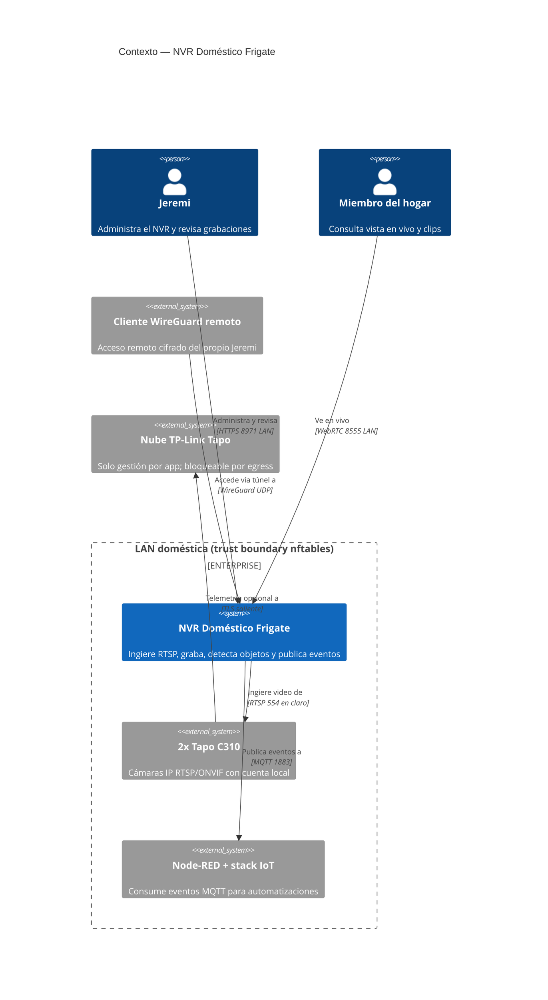
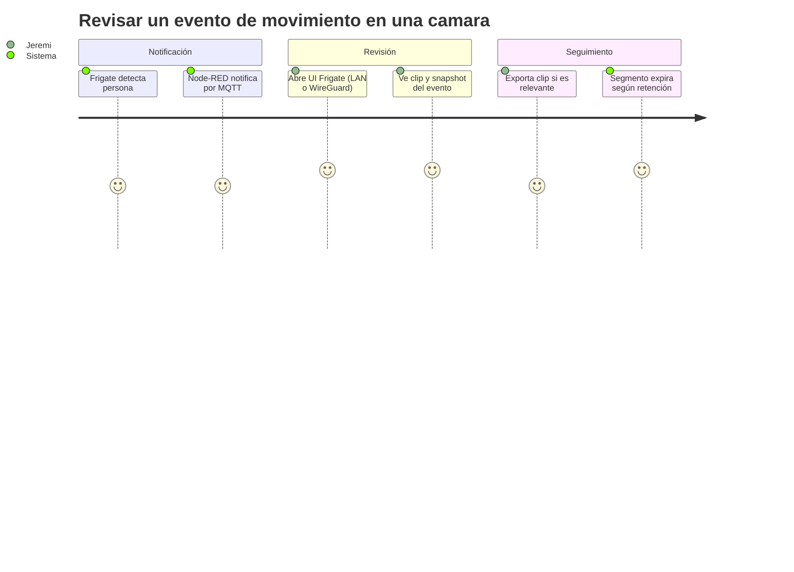
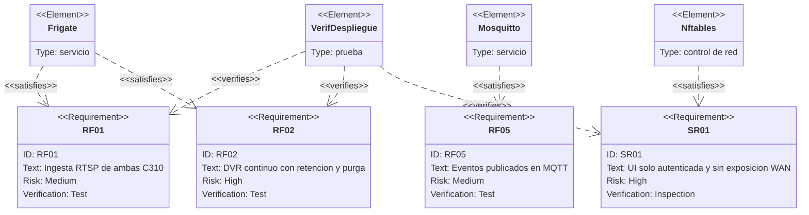
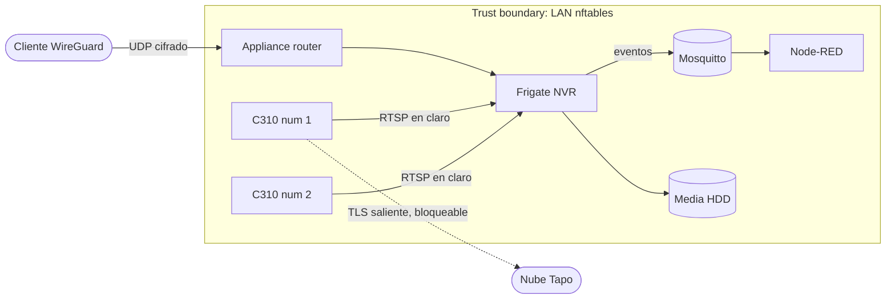
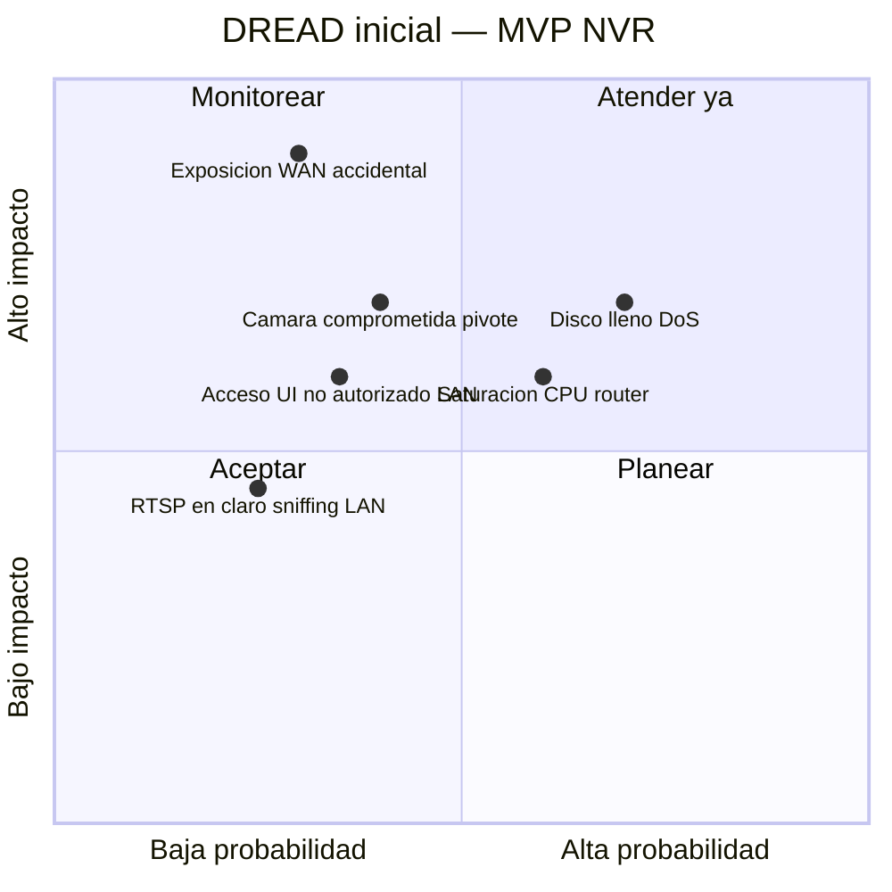

# PRD — MVP NVR: despliegue Frigate + cámaras ONVIF

* **Estado:** approved (Gate 0, 2026-08-30)
* **Fecha:** 2026-08-30
* **Decisores:** Jeremi
* **Fase AI-DLC:** 01-requirements
* **Versión:** 0.1.0
* **Gate:** 0
* **Feature/Épica ID:** NVR-MVP-001
* **Nivel ASVS objetivo:** L1

## Problema y contexto
Las cámaras del hogar están fragmentadas: 2× Tapo C310 (RTSP/ONVIF, visibles solo en la
app Tapo) y 2× Blink Mini (cloud Amazon, sin acceso local). No hay grabación continua
propia, ni retención controlada, ni eventos integrables con el stack IoT (MQTT/Node-RED)
que corre en el appliance de red. Se necesita un concentrador local tipo DVR con
monitoreo casi en tiempo real y capacidad de ampliar cámaras.

## Objetivos / No-objetivos
- **Objetivos:** NVR local con Frigate; ingesta de las 2 C310; DVR continuo con retención;
  vista en vivo ≤2 s; detección de persona/vehículo; eventos por MQTT; cero exposición WAN.
- **No-objetivos:** integrar Blink Mini (técnicamente inviable: sin RTSP ni workaround
  mantenido); Coral/GPU; búsqueda semántica (sin AVX2); Home Assistant; audio (legal FL).

## Contexto del sistema (C4 Context)

## Usuarios y escenarios

### Journey del usuario

### Escenarios positivos
1. Grabación 24/7 de ambas C310 con purga automática por retención.
2. Persona entra al encuadre → evento con clip/snapshot → mensaje en `frigate/events`.
3. Vista en vivo desde el móvil por WireGuard con latencia ≤2 s.
4. Alta de una tercera cámara ONVIF editando solo `config.yml` (ampliable).

### Escenarios negativos / abuso (requerido por Gate 0)
- **A1 — Acceso no autorizado a la UI:** un invitado de la LAN intenta abrir la UI del
  NVR → la autenticación de Frigate (puerto 8971) lo bloquea; el puerto 5000 interno no
  se publica.
- **A2 — Exposición WAN accidental:** un error de compose publica puertos en las
  interfaces WAN → nftables (default drop en WAN input) actúa como segunda barrera.
- **A3 — Cámara comprometida como pivote:** una C310 vulnerada intenta escanear la LAN o
  exfiltrar a internet → regla de egress que aísla a las cámaras (solo puede hablarle el
  NVR; salida a internet bloqueada).
- **A4 — DoS por disco lleno:** la grabación llena el HDD y tumba servicios del router →
  media en ruta dedicada + retención con purga + alerta de watermark.
- **A5 — Robo de credenciales RTSP:** las credenciales viajan en claro por RTSP → cuentas
  de cámara dedicadas (no la cuenta TP-Link), alcance limitado a la LAN, rotación.
- **A6 — Captura de audio ilegal:** grabar audio sin consentimiento infringe FL §934.03 →
  audio deshabilitado en cámara y en Frigate.

## Requisitos funcionales
| ID | Requisito |
|---|---|
| RF01 | Ingerir RTSP de las 2 C310 (stream1 grabación, stream2 detección) |
| RF02 | Grabación continua con retención de 3 días y 14 días para alertas |
| RF03 | Detectar persona y vehículo con CPU sobre el sub-stream a 5 fps |
| RF04 | Vista en vivo ≤2 s vía go2rtc (WebRTC) |
| RF05 | Publicar eventos en MQTT (`frigate/events`) consumibles por Node-RED |
| RNF01 | CPU sostenida del NVR <50 % para no degradar el enrutamiento |
| RNF02 | Decodificación por hardware VAAPI (i965) |

## Trazabilidad de requisitos

## Requisitos de seguridad (mapeados a OWASP ASVS)
| Req | ASVS | Nivel | OWASP Top 10 |
|---|---|---|---|
| SR01: UI autenticada (8971), puerto 5000 no publicado | V2.1 Autenticación | L1 | A01, A07 |
| SR02: cero puertos NVR alcanzables desde WAN (nftables) | V13 Config de red | L1 | A05 |
| SR03: credenciales en `.env` (600), nunca en git | V6 Secretos | L1 | A02 |
| SR04: cámaras aisladas (egress deny a internet) | V13 | L1 | A05 |
| SR05: imagen pineada `0.17.2` (sin `latest`/`stable`) | V14 Integridad | L1 | A08 |
| SR06: audio deshabilitado (FL §934.03) | — legal | — | — |

## Threat assessment inicial

## Métricas de éxito
Las del charter, más: evento visible en `frigate/events` <3 s tras la detección;
purga verificada al alcanzar la retención.

## Dependencias y riesgos
- Depende de: reservas DHCP en dnsmasq para las cámaras; Docker instalado; HDD con
  ≥200 GB libres para media.
- Riesgo abierto: rendimiento real del detector CPU en Ivy Bridge — medir en despliegue
  y, si excede presupuesto, bajar fps de detección o planificar acelerador (ciclo 2).
