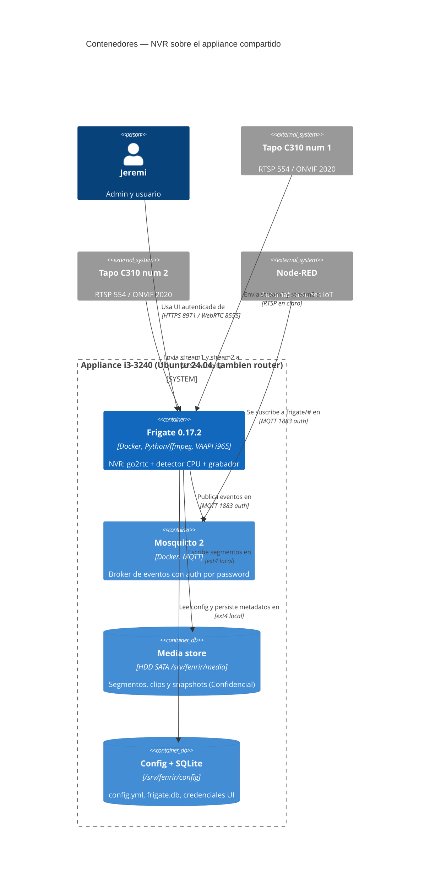
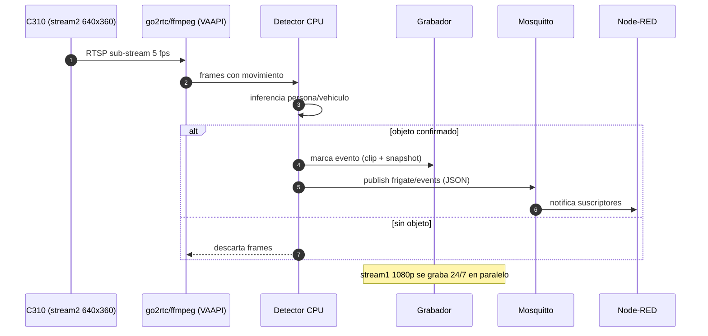
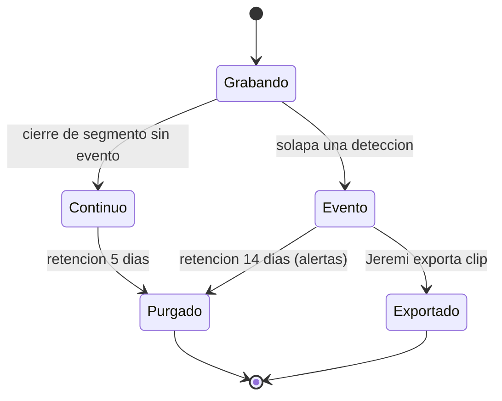
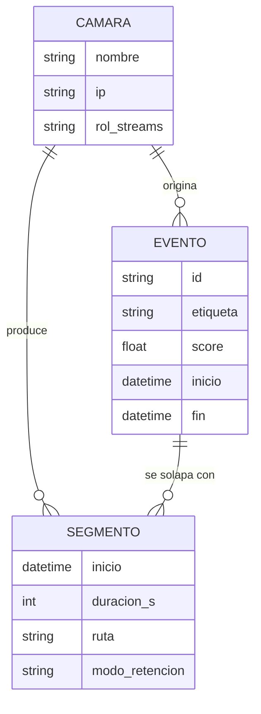

# Diseño del Sistema — NVR Doméstico Frigate

* **Estado:** approved (Gate 1, 2026-08-30)
* **Fecha:** 2026-08-30
* **Decisores:** Jeremi
* **Fase AI-DLC:** 02-design
* **Versión:** 0.1.0
* **Gate:** 1
* **Estilo arquitectónico:** Servicios COTS contenedorizados sobre host compartido (sin código propio)
* **ADRs relacionadas:** ADR-0001, ADR-0002, ADR-0003

## Contextos acotados (DDD)
| Bounded Context | Responsabilidad | Entidades núcleo |
|---|---|---|
| Vigilancia | Ingesta, grabación, detección, eventos | Cámara, Segmento, Evento |
| Red doméstica | Transporte, aislamiento, acceso remoto | Reserva DHCP, reglas nftables, peer WireGuard |

## Vista C4 — Container

Nota C4 Component: los internos de Frigate (go2rtc, detector, recorder) son COTS y su
descomposición no aporta decisiones propias; se omite por la regla anti-ruido. El
`classDiagram` (Code) no aplica: el MVP es configuración, no desarrollo.

## Flujos críticos (comportamiento)

## Ciclo de vida de la entidad núcleo (Segmento de grabación)

## Modelo de datos y dominio

## Contratos de API (interfaces del sistema)
| Interfaz | Endpoint | Protocolo | AuthN/Z | Consumidor |
|---|---|---|---|---|
| Ingesta principal | `rtsp://<user>:<pass>@<ip-cam>:554/stream1` | RTSP | Cuenta local de cámara | Frigate (rol record vía go2rtc) |
| Ingesta detección | `rtsp://<user>:<pass>@<ip-cam>:554/stream2` | RTSP | Cuenta local de cámara | Frigate (rol detect) |
| UI + API | `https://<ip-lan>:8971/` | HTTPS | Login Frigate (admin generado al primer arranque) | Jeremi / hogar |
| Restream | `rtsp://<ip-lan>:8554/<camara>` | RTSP | go2rtc | Consumidores LAN (VLC) |
| Vivo baja latencia | `:8555` TCP/UDP | WebRTC | Sesión UI | Navegador/móvil (requiere `go2rtc.webrtc.candidates`; sin ellos degrada a MSE y RF04 no se cumple) |
| Eventos | topic `frigate/events` | MQTT | usuario/clave Mosquitto | Node-RED |
| Disponibilidad | topic `frigate/available` | MQTT | ídem | Node-RED (watchdog) |

Puerto 5000 (API interna sin auth): **no publicado** fuera del contenedor.

## Patrones de seguridad seleccionados (por amenaza DREAD priorizada)
| Amenaza | Patrón / Control | OWASP |
|---|---|---|
| Exposición WAN accidental | Defensa en profundidad: bind de los puertos publicados a la IP LAN (primario) + `DOCKER-USER`/default-drop nftables (secundario) | A05 |
| Disco lleno (DoS) | Cuota implícita por retención + purga automática + watermark monitorizado | A05 |
| Cámara comprometida | Segmentación: egress deny de cámaras a internet y a la LAN salvo NVR | A05 |
| Acceso UI no autorizado | AuthN nativa Frigate en 8971; 5000 solo loopback del contenedor | A01/A07 |
| Secretos en repo | `.env` fuera de git + sustitución `FRIGATE_*` en config | A02 |
| Captura de audio ilegal (SR06) | Doble control: micrófono off en cámara + `preset-record-generic` (graba sin pista de audio) | — legal |
| Supply chain imagen | Tag pineado `0.17.2` + revisión de release notes antes de subir | A08 |
