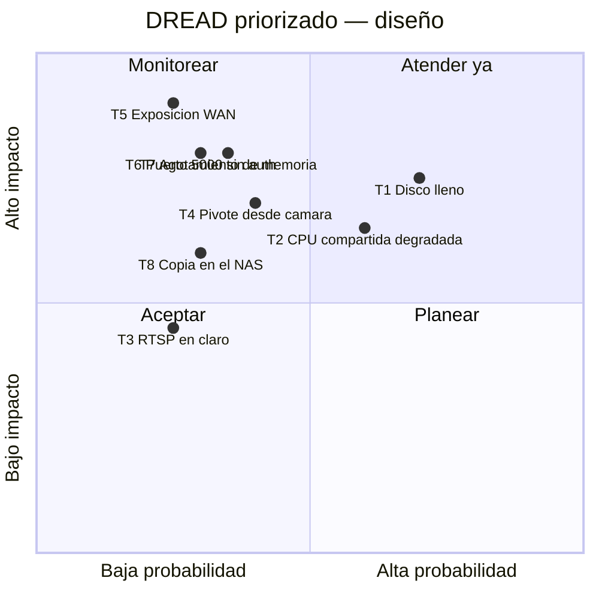

# Threat Model — NVR Doméstico Frigate

* **Estado:** approved (Gate 1, 2026-08-30)
* **Fecha:** 2026-08-30
* **Decisores:** Jeremi
* **Fase AI-DLC:** 02-design
* **Versión:** 0.1.0
* **Gate:** 1
* **Alcance:** NVR (Frigate + Mosquitto + media) sobre el appliance router compartido
* **Metodología:** STRIDE + DREAD
* **Clasificación de datos (ref):** `docs/00-project/data-classification.md`

## Diagrama de flujo de datos (DFD)

El DFD del sistema vive en el PRD (`docs/01-requirements/mvp-nvr.md`, threat assessment) y
es el insumo de este análisis — no se duplica (regla anti-ruido). Trust boundaries:
1. **WAN ↔ appliance**: nftables default-drop; nada del NVR cruza este límite.
2. **LAN ↔ segmento cámaras**: las C310 solo aceptan/emiten tráfico con el NVR; egress a
   internet bloqueado (opcional dejar NTP). **Estado actual (ADR-0007)**: las cámaras están
   fuera de este boundary, en el Wi-Fi del lado WAN. El NVR las alcanza como cliente RTSP
   saliente por WAN2, así que no se abre ningún puerto de entrada y SR02 se mantiene.
3. **Host ↔ contenedores**: Docker sin `privileged`; solo `/dev/dri` expuesto a Frigate.
4. **LAN ↔ remoto**: únicamente peers WireGuard autenticados.

## Análisis STRIDE
| Componente | Spoofing | Tampering | Repudiation | Info Disclosure | DoS | Elevation |
|---|---|---|---|---|---|---|
| UI Frigate (8971) | Fuerza bruta login → password fuerte, LAN-only | Config alterada → permisos 600 y git | Sin log centralizado (aceptado MVP) | Sesiones robadas en LAN → riesgo bajo, HTTPS interno | Flood LAN (bajo) | Puerto 5000 sin auth → **no publicado** |
| Streams RTSP cámaras | Cámara falsa suplanta IP → reserva DHCP + credencial por cámara | Inyección de video (MITM LAN) → aceptado L1, LAN física controlada | — | **Video y credenciales en claro** → confinado a LAN, VLAN futura | Desconexión de cámara → watchdog `frigate/available` | Firmware cámara comprometido → egress deny, actualizaciones |
| Mosquitto (1883) | Cliente anónimo → `allow_anonymous false` + passwd | Publicación de eventos falsos → credencial única por cliente | — | Metadatos de presencia en topics → auth obligatoria | Flood de publish → solo 2 clientes autorizados | — |
| Media store (HDD) | — | Borrado/alteración local → acceso físico controlado | — | Robo del disco → sin cifrado, riesgo asumido. **El respaldo duplica la exposición al NAS (T8)** | **Disco lleno** → retención + purga + alerta 90 % | — |
| Host compartido (router) | — | — | — | — | **Detector CPU compite con NAT/WireGuard** → límite fps, nice/cpuset opcional. **Memoria**: sin `mem_limit` el OOM killer elige víctima por heurística → límite por contenedor (T7) | Escape de contenedor → imagen oficial pineada, sin privileged |

## Amenazas priorizadas (DREAD)

| ID | Amenaza | D | R | E | A | D | Score | Control / ADR |
|---|---|---|---|---|---|---|---|---|
| T1 | Grabación llena el HDD y degrada el router. **No hay volumen dedicado** (verificado 2026-09-09: `/srv` comparte LV con la raíz y el VG no tiene espacio libre), así que llenarlo afecta a todo el host, no solo al NVR — el umbral baja al 85 % y el watermark pasa de segunda barrera a primera. **Escala a memoria**: el `tmpfs` es donde aterrizan los segmentos antes de moverse al HDD, así que un disco lleno impide drenar la caché y esta crece hacia su techo de 954 MiB en RAM (ver T7) | 7 | 9 | 8 | 8 | 6 | 7.6 | Retención + purga (config.yml); ruta dedicada; rotación de logs json-file; `mem_limit` acota el desbordamiento; alerta watermark (runbook §7) |
| T2 | Detector satura CPU y degrada NAT/WireGuard | 6 | 8 | 7 | 8 | 7 | 7.2 | detect 5 fps sub-stream + VAAPI; medir y ajustar (Gate 1 HITL); ADR-0002 |
| T5 | Puertos NVR expuestos a WAN por error | 9 | 3 | 4 | 9 | 5 | 6.0 | Bind explícito a `${FRIGATE_LAN_IP}` en compose (Docker hace DNAT y **no** pasa por `input`, así que el default-drop por sí solo no basta) + reglas `DOCKER-USER`; verificación §8 del runbook |
| T6 | API 5000 sin auth alcanzable en LAN | 8 | 4 | 6 | 6 | 6 | 6.0 | Puerto no mapeado en compose; solo 8971 autenticado |
| T7 | Agotamiento de memoria del host: el OOM killer del kernel elige víctima por heurística y puede matar `dnsmasq` (DNS/DHCP de la casa) en vez de Frigate | 8 | 3 | 3 | 8 | 5 | 5.4 | `mem_limit` acota el contenedor: mata Docker a Frigate, no el kernel al router (RNF03); alerta de `MemAvailable` |
| T4 | C310 comprometida pivotea o exfiltra | 7 | 4 | 5 | 6 | 5 | 5.4 | Egress deny cámaras (nftables). **Mientras dure ADR-0007 esta amenaza está más contenida, no menos**: las cámaras quedan al otro lado del `default drop` de entrada WAN y no alcanzan la LAN en absoluto. Al migrarlas a la LAN definitiva, el egress deny pasa de deseable a obligatorio |
| T8 | El respaldo crea una segunda ubicación de video Confidencial: comprometer o robar el NAS expone el mismo material que proteger el appliance | 6 | 4 | 4 | 5 | 5 | 4.8 | Solo alertas, snapshots y `config/` (no el continuo); cuenta SSH dedicada de solo lectura restringida por `command=`; el NAS hereda la clasificación de datos (ADR-0006) |
| T3 | Sniffing RTSP/credenciales. **Elevada temporalmente a 6.0 por ADR-0007**: las cámaras están en un Wi-Fi del lado WAN que el appliance no gobierna, así que la justificación original —control físico del segmento— no aplica. Acotado a quien tenga la contraseña de ese Wi-Fi, no expuesto a internet | 6 | 5 | 6 | 6 | 7 | **6.0 (temporal)** / 4.2 (destino) | Credencial única por cámara y **rotación al migrar**; WPA2/WPA3 fuerte. Vuelve a 4.2 al cumplirse la condición de salida de ADR-0007 |

## Controles y trazabilidad
- T1, T2 → `deploy/frigate/config.yml` (retención, fps) + runbook §7 (verificación de carga)
  + reglas de disco en `deploy/prometheus/frigate-rules.yml`. El control *"ruta dedicada"*
  del diseño **no está disponible** en este host y se sustituye por umbral más conservador.
- T4, T5 → reglas nftables del proyecto router (pendientes de MACs/IPs definitivas de las
  cámaras — **entrada para el ciclo de configuración de red ya en curso**).
- T5, T6 → `deploy/docker-compose.yml` (mapeo mínimo + bind a la IP LAN; 5000 sin publicar).
- T3, T4 → ADR-0007 mientras las cámaras estén fuera de la LAN. La ADR lleva la condición de
  salida y el orden en que se restauran los controles: mover, **rotar credenciales**, aplicar
  egress deny, devolver T3 a 4.2.
- T8 → ADR-0006: el NAS tira por SSH y el appliance no monta nada, así que el respaldo no
  añade dependencias ni puntos de bloqueo al host que enruta. Verificación en T-19.
- T7 → `mem_limit` en ambos servicios (RNF03) + SLI `frigate_mem_usage_percent` y alerta de
  `MemAvailable` del host; verificación en T-17. El acoplamiento T1→T7 es el hallazgo que
  motivó el requisito: el disco lleno no es solo un problema de disco.
- SR06 (audio) → `deploy/frigate/config.yml`: `ffmpeg.output_args.record: preset-record-generic`.
  El default de Frigate graba audio (`preset-record-generic-audio-aac`); apagar el micrófono
  en la cámara era un control de un solo punto de fallo.
- Secretos → `.env` (600) + sustitución `FRIGATE_*`; ADR-0003.
- Sin trazabilidad pendiente: cada amenaza tiene control o aceptación explícita.
