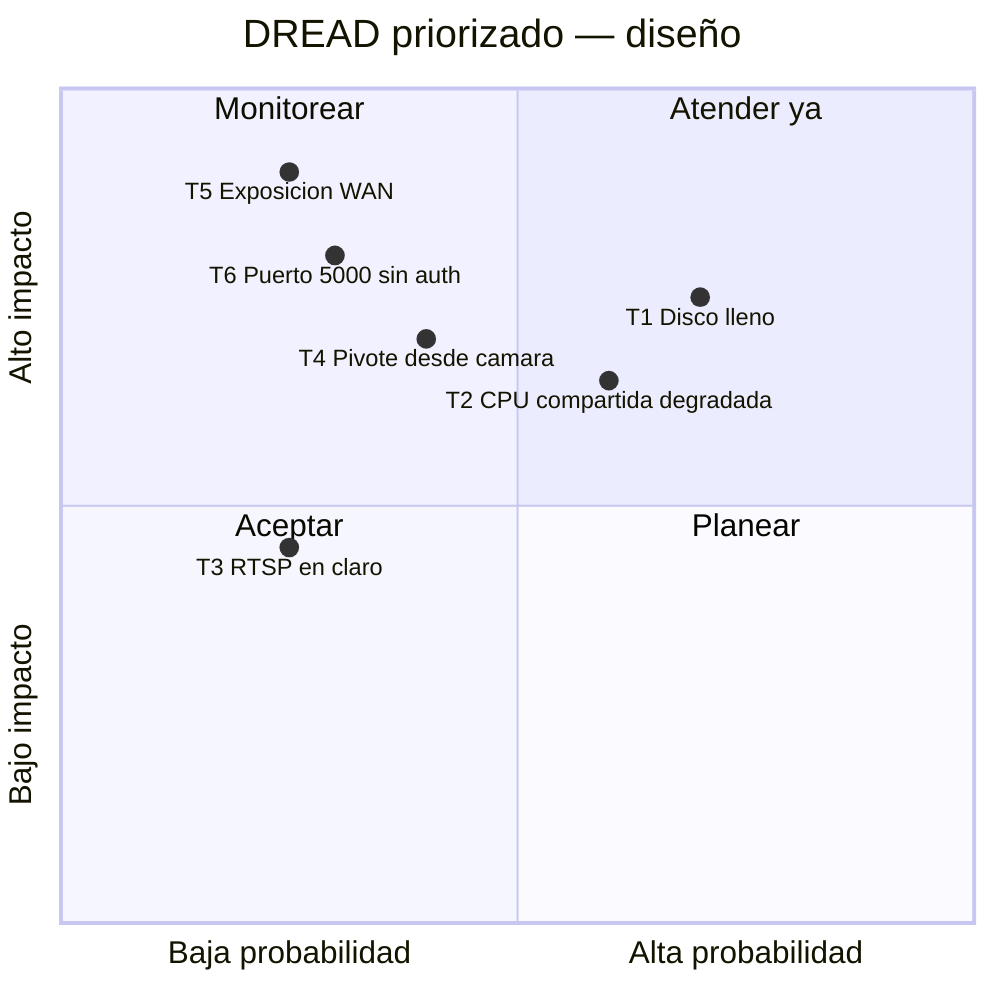

# Threat Model — NVR Doméstico Frigate

* **Estado:** approved (Gate 1, 2026-08-30)
* **Fecha:** 2026-08-30
* **Decisores:** Jeremi
* **Fase AI-DLC:** 02-design
* **Versión:** 0.1.0
* **Gate:** 1
* **Alcance:** NVR (Frigate + Mosquitto + media) sobre el appliance router compartido
* **Metodología:** STRIDE + DREAD
* **Clasificación de datos (ref):** `docs/00-project/data-classification.md`

## Diagrama de flujo de datos (DFD)

El DFD del sistema vive en el PRD (`docs/01-requirements/mvp-nvr.md`, threat assessment) y
es el insumo de este análisis — no se duplica (regla anti-ruido). Trust boundaries:
1. **WAN ↔ appliance**: nftables default-drop; nada del NVR cruza este límite.
2. **LAN ↔ segmento cámaras**: las C310 solo aceptan/emiten tráfico con el NVR; egress a
   internet bloqueado (opcional dejar NTP).
3. **Host ↔ contenedores**: Docker sin `privileged`; solo `/dev/dri` expuesto a Frigate.
4. **LAN ↔ remoto**: únicamente peers WireGuard autenticados.

## Análisis STRIDE
| Componente | Spoofing | Tampering | Repudiation | Info Disclosure | DoS | Elevation |
|---|---|---|---|---|---|---|
| UI Frigate (8971) | Fuerza bruta login → password fuerte, LAN-only | Config alterada → permisos 600 y git | Sin log centralizado (aceptado MVP) | Sesiones robadas en LAN → riesgo bajo, HTTPS interno | Flood LAN (bajo) | Puerto 5000 sin auth → **no publicado** |
| Streams RTSP cámaras | Cámara falsa suplanta IP → reserva DHCP + credencial por cámara | Inyección de video (MITM LAN) → aceptado L1, LAN física controlada | — | **Video y credenciales en claro** → confinado a LAN, VLAN futura | Desconexión de cámara → watchdog `frigate/available` | Firmware cámara comprometido → egress deny, actualizaciones |
| Mosquitto (1883) | Cliente anónimo → `allow_anonymous false` + passwd | Publicación de eventos falsos → credencial única por cliente | — | Metadatos de presencia en topics → auth obligatoria | Flood de publish → solo 2 clientes autorizados | — |
| Media store (HDD) | — | Borrado/alteración local → acceso físico controlado | — | Robo del disco → sin cifrado, riesgo asumido y documentado | **Disco lleno** → retención + purga + alerta 90 % | — |
| Host compartido (router) | — | — | — | — | **Detector CPU compite con NAT/WireGuard** → límite fps, nice/cpuset opcional | Escape de contenedor → imagen oficial pineada, sin privileged |

## Amenazas priorizadas (DREAD)

| ID | Amenaza | D | R | E | A | D | Score | Control / ADR |
|---|---|---|---|---|---|---|---|---|
| T1 | Grabación llena el HDD y degrada el router | 7 | 9 | 8 | 8 | 6 | 7.6 | Retención + purga (config.yml); ruta dedicada; rotación de logs json-file (compose); alerta watermark (runbook §7) |
| T2 | Detector satura CPU y degrada NAT/WireGuard | 6 | 8 | 7 | 8 | 7 | 7.2 | detect 5 fps sub-stream + VAAPI; medir y ajustar (Gate 1 HITL); ADR-0002 |
| T5 | Puertos NVR expuestos a WAN por error | 9 | 3 | 4 | 9 | 5 | 6.0 | Bind explícito a `${FRIGATE_LAN_IP}` en compose (Docker hace DNAT y **no** pasa por `input`, así que el default-drop por sí solo no basta) + reglas `DOCKER-USER`; verificación §8 del runbook |
| T6 | API 5000 sin auth alcanzable en LAN | 8 | 4 | 6 | 6 | 6 | 6.0 | Puerto no mapeado en compose; solo 8971 autenticado |
| T4 | C310 comprometida pivotea o exfiltra | 7 | 4 | 5 | 6 | 5 | 5.4 | Egress deny cámaras (nftables, pendiente MACs); credencial por cámara |
| T3 | Sniffing RTSP/credenciales en LAN | 5 | 3 | 4 | 5 | 4 | 4.2 | Aceptado L1 (LAN física propia); mitigación futura: VLAN cámaras |

## Controles y trazabilidad
- T1, T2 → `deploy/frigate/config.yml` (retención, fps) + runbook §7 (verificación de carga).
- T4, T5 → reglas nftables del proyecto router (pendientes de MACs/IPs definitivas de las
  cámaras — **entrada para el ciclo de configuración de red ya en curso**).
- T5, T6 → `deploy/docker-compose.yml` (mapeo mínimo + bind a la IP LAN; 5000 sin publicar).
- SR06 (audio) → `deploy/frigate/config.yml`: `ffmpeg.output_args.record: preset-record-generic`.
  El default de Frigate graba audio (`preset-record-generic-audio-aac`); apagar el micrófono
  en la cámara era un control de un solo punto de fallo.
- Secretos → `.env` (600) + sustitución `FRIGATE_*`; ADR-0003.
- Sin trazabilidad pendiente: cada amenaza tiene control o aceptación explícita.
