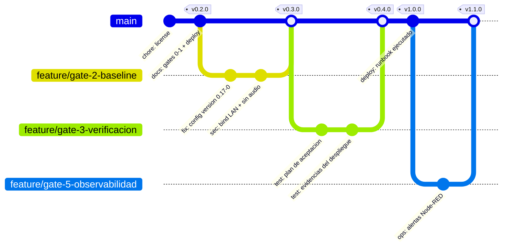

# Implementación — baseline de configuración y cadena de suministro

* **Estado:** draft
* **Fecha:** 2026-08-30
* **Decisores:** Jeremi
* **Fase AI-DLC:** 03-implementation
* **Versión:** 0.3.0
* **Gate:** 2
* **Rama principal:** main
* **Estrategia de branching:** trunk-based con ramas cortas por gate
* **ADRs relacionadas:** ADR-0003 (imagen pineada), ADR-0004 (retención), ADR-0005 (observabilidad)

## Qué significa "implementar" en este proyecto

No hay código propio: el sistema es COTS configurado (Frigate + Mosquitto). El artefacto
implementado es el **conjunto de archivos de `deploy/`**, y el Gate 2 se traduce así:

| Gate 2 canónico | Equivalente aquí | Evidencia |
|---|---|---|
| SAST limpio | Config validada: `docker compose config` + arranque sin `config validation error` | §Validación |
| Dependencias verificadas | Imágenes pineadas por tag **y digest**, escaneadas | §Cadena de suministro |
| 80 % de cobertura | No aplica → se sustituye por cobertura de **requisitos**: cada RF/RNF con un caso de aceptación (Gate 3) | `docs/04-testing/test-plan.md` |

El `classDiagram` de nivel Code no se dibuja: no hay abstracciones propias que documentar
(regla anti-ruido — un diagrama que no responde una pregunta no se dibuja).

## Inventario de artefactos y su trazabilidad

| Archivo | Qué decide | Traza a |
|---|---|---|
| `deploy/docker-compose.yml` | Imágenes, bind de puertos, devices, logging, tmpfs | ADR-0003, T1, T5, T6 |
| `deploy/frigate/config.yml` | Cámaras, detector, retención, review, audio, WebRTC | RF01–RF05, RNF02, SR06, ADR-0004 |
| `deploy/mosquitto/mosquitto.conf` | Auth obligatoria del broker | RF05, STRIDE·Mosquitto |
| `deploy/.env.example` | Contrato de secretos y de la IP LAN | SR03, T5, RF04 |

Cambios de configuración con impacto en seguridad o en un requisito **no se hacen sueltos**:
entran por el flujo del §9 del runbook y se anotan en el `CHANGELOG.md`.

## Estrategia de ramas y releases



Una rama por gate, vida corta, merge a `main` al aprobar el gate y tag SemVer que coincide
con el corte del `CHANGELOG`. Cuando exista historial real, este grafo se **deriva**, no se
mantiene a mano:

```bash
python ~/.claude/skills/ai-dlc/scripts/gitgraph_from_log.py . --branch main \
  --out docs/03-implementation/repo-history.md
```

## Validación de configuración (equivalente a SAST)

```bash
# 1. El compose renderiza y las variables del .env resuelven
docker compose -f deploy/docker-compose.yml config >/dev/null && echo compose-ok

# 2. Ningún puerto queda en 0.0.0.0 (T5) — revisar host_ip en el render
docker compose -f deploy/docker-compose.yml config | grep -E 'host_ip|published'

# 3. El YAML de Frigate parsea antes de tocar el appliance
python -c "import yaml;yaml.safe_load(open('deploy/frigate/config.yml',encoding='utf-8'))"

# 4. Los diagramas de la documentación siguen siendo válidos
python ~/.claude/skills/ai-dlc/scripts/validate_mermaid.py docs
```

El arranque real es la validación definitiva: Frigate rechaza un config inválido y lo dice
en el log. `docker compose logs frigate | grep -i "validation"` debe salir vacío.

**Versión del schema.** `config.yml` declara `version: 0.17-0`, que es el
`CURRENT_CONFIG_VERSION` de `frigate/util/config.py` en el tag `v0.17.2`. Declarar una
versión superior a la del binario hace que las migraciones se salten en silencio. Al subir
de minor, comparar este valor con el del nuevo tag **antes** de arrancar.

## Cadena de suministro (OWASP A03)

Pinear por tag no es suficiente: un tag puede reapuntarse. Fijar y registrar el digest.

```bash
docker pull ghcr.io/blakeblackshear/frigate:0.17.2
docker pull eclipse-mosquitto:2
docker image inspect ghcr.io/blakeblackshear/frigate:0.17.2 \
  --format '{{index .RepoDigests 0}}'
docker image inspect eclipse-mosquitto:2 --format '{{index .RepoDigests 0}}'
```

| Imagen | Tag | Digest (rellenar en el despliegue) | Escaneo |
|---|---|---|---|
| `ghcr.io/blakeblackshear/frigate` | `0.17.2` | `sha256:…` | `trivy image` / `docker scout cves` |
| `eclipse-mosquitto` | `2` | `sha256:…` | ídem |

`eclipse-mosquitto:2` es un tag **móvil** (sigue la serie 2.x). Es una decisión distinta a la
de Frigate y consciente: el broker no tiene schema de config que rompa entre parches y los
arreglos de seguridad interesan pronto. Si se prefiere reproducibilidad estricta, sustituir
por el digest fijado arriba.

Antes de cualquier subida de versión: leer las release notes del tag destino, hacer backup de
`/srv/frigate/config` (incluye `frigate.db`) y seguir el flujo del §9 del runbook.

## Secretos (OWASP A02)

- `.env` (modo 600) y `deploy/mosquitto/passwd` están en `.gitignore`; el repo solo lleva
  `.env.example` con valores de relleno.
- Frigate sustituye únicamente variables con prefijo `FRIGATE_`; ese prefijo es el contrato.
- Verificación antes de publicar, y en cada gate:
  ```bash
  gitleaks detect --no-git --redact   # o: git log -p | grep -iE 'password|rtsp://[^ ]*:'
  ```
- Rotación: cuenta de cámara Tapo y usuarios MQTT se rotan al cerrar el Gate 4 y ante
  cualquier sospecha; rotar implica `mosquitto_passwd` + `.env` + `docker compose up -d`.

## Riesgo abierto que entra al Gate 3

El detector `cpu` es el único viable (OpenVINO exige Skylake o superior; el i3-3240 es Ivy
Bridge). Su coste real es desconocido hasta medirlo. La señal temprana de saturación es
`frigate_skipped_fps > 0`: significa que el detector no da abasto y se están descartando
frames. Se mide en el Gate 3 y decide si ADR-0002 se acepta o se reabre.
