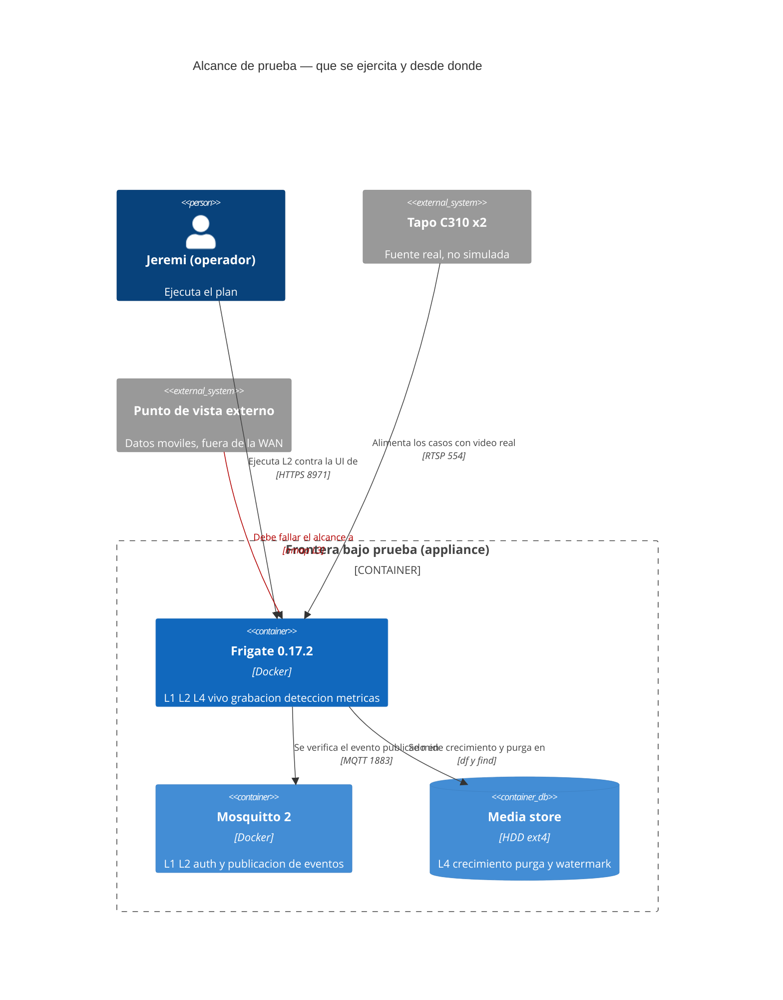

# Plan de verificación — MVP NVR

* **Estado:** draft
* **Fecha:** 2026-08-30
* **Decisores:** Jeremi
* **Fase AI-DLC:** 04-testing
* **Versión:** 0.4.0
* **Gate:** 3
* **Alcance de prueba:** sistema desplegado en el appliance (no hay unidades que probar)
* **Requisitos cubiertos:** RF01–RF05, RNF01–RNF03, SR01–SR06, abusos A1–A6

## Estrategia

La pirámide de tests no aplica: no hay código propio, así que no hay unidad ni integración
que escribir. Lo que sí existe es **una frontera de sistema real y verificable**. Los niveles
se reordenan de abajo arriba así:

| Nivel | Qué prueba | Cuándo | Automatizable |
|---|---|---|---|
| L0 Config | El compose y el YAML son válidos y coherentes | Antes de tocar el appliance | Sí (§Validación de la fase 03) |
| L1 Servicios | Contenedores arriba, se ven entre sí, MQTT autentica | Tras `up -d` | Parcial |
| L2 Aceptación | Cada RF hace lo que el PRD promete | Runbook §7 | No (requiere ojo humano y caminar) |
| L3 Seguridad | Los abusos A1–A6 fallan como deben | Tras el endurecimiento §8 | Parcial (nmap, ss) |
| L4 Carga y tiempo | RNF01/RNF02 y la retención, que solo se prueba dejando pasar días | 72 h + día 4 + día 15 | Sí (muestreo) |

Nada aquí es "real vs. mock": **todo se prueba contra el sistema real**. La única sustitución
posible es simular el disco lleno, y eso se hace con un archivo de relleno, no con un mock.

## Alcance de prueba sobre la arquitectura

## Trazabilidad requisito ↔ prueba

Cierra el círculo que el Gate 0 dejó abierto: allí los elementos `satisfies` decían quién
cumple cada requisito; aquí los `verifies` dicen quién lo demuestra.

```mermaid
requirementDiagram
    requirement RF01 {
      id: RF01
      text: Ingesta RTSP de ambas C310
      risk: medium
      verifymethod: test
    }
    requirement RF02 {
      id: RF02
      text: DVR continuo con retencion y purga
      risk: high
      verifymethod: test
    }
    requirement RF04 {
      id: RF04
      text: Vista en vivo menor o igual a 2 segundos
      risk: medium
      verifymethod: demonstration
    }
    requirement RF05 {
      id: RF05
      text: Eventos publicados en MQTT
      risk: medium
      verifymethod: test
    }
    requirement RNF01 {
      id: RNF01
      text: CPU sostenida bajo el 50 por ciento
      risk: high
      verifymethod: analysis
    }
    requirement RNF03 {
      id: RNF03
      text: Memoria acotada y host con 4 GB disponibles
      risk: high
      verifymethod: analysis
    }
    requirement SR01 {
      id: SR01
      text: UI solo autenticada y sin exposicion WAN
      risk: high
      verifymethod: inspection
    }
    requirement SR06 {
      id: SR06
      text: Sin captura de audio
      risk: high
      verifymethod: test
    }
    element T_Ingesta {
      type: "caso de prueba"
    }
    element T_Retencion {
      type: "caso de prueba"
    }
    element T_Latencia {
      type: "caso de prueba"
    }
    element T_Eventos {
      type: "caso de prueba"
    }
    element T_Carga {
      type: "caso de prueba"
    }
    element T_Memoria {
      type: "caso de prueba"
    }
    element T_Exposicion {
      type: "caso de prueba"
    }
    element T_Audio {
      type: "caso de prueba"
    }
    T_Ingesta - verifies -> RF01
    T_Retencion - verifies -> RF02
    T_Latencia - verifies -> RF04
    T_Eventos - verifies -> RF05
    T_Carga - verifies -> RNF01
    T_Memoria - verifies -> RNF03
    T_Exposicion - verifies -> SR01
    T_Audio - verifies -> SR06
```

## Casos de aceptación

Cada caso se ejecuta una vez y se anota su evidencia (captura, salida de comando o nota) en
la última columna. Un caso sin evidencia **no cuenta como aprobado**.

| ID | Req | Procedimiento | Criterio de aprobación | Evidencia |
|---|---|---|---|---|
| T-01 | RF01 | `ffprobe` a `stream1` y `stream2` de ambas IPs | h264 1920×1080 y 640×360, sin error de auth | |
| T-02 | RF01 | UI: ambas cámaras muestran imagen | 2/2 con imagen viva, sin reconexiones en el log | |
| T-03 | RF02 | `find /srv/frigate/media/frigate/recordings -newermt '-10 min'` | Aparecen segmentos nuevos de ambas cámaras | |
| T-04 | RF03 | Caminar frente a cada cámara | Review item con etiqueta `person` en ambas | |
| T-05 | RF03 | Pasar un coche por el encuadre que lo permita | Etiqueta `car`, clasificado como alerta y no como detección | |
| T-06 | RF04 | Cronometrar reloj real contra la imagen en pantalla, en LAN | ≤2 s | |
| T-07 | RF04 | Repetir T-06 por WireGuard desde datos móviles | ≤2 s y el modo negociado es WebRTC, no MSE | |
| T-08 | RF05 | `mosquitto_sub -u nodered -t 'frigate/#' -v` mientras se dispara T-04 | Llega `frigate/events` con el objeto, retraso <3 s | |
| T-09 | RF05 | Detener el contenedor frigate con el `sub` abierto | `frigate/available` pasa a `offline` por LWT | |
| T-10 | RNF02 | `sudo intel_gpu_top` durante la grabación | Video engine >0 %: decodifica la iGPU, no la CPU | |
| T-11 | RNF01 | 15 min con detección activa: `docker stats` y `htop` | CPU sostenida del proyecto <50 % | |
| T-12 | RNF01 | Métrica `frigate_skipped_fps` durante T-11 | **0**. Si es >0 el detector no da abasto: canario de T2 | |
| T-13 | SR06 | `ffprobe -show_streams -select_streams a` sobre un segmento nuevo | Cero streams de audio | |
| T-14 | RF02 | Al día 4: buscar el segmento continuo más antiguo | Nada anterior a 3 días, el disco no crece sin límite | |
| T-15 | RF02 | Al día 15: revisar alertas y snapshots antiguos | Nada anterior a 14 días | |
| T-16 | — | Exportar un clip desde la UI | El archivo exportado existe y se reproduce | |
| T-17 | RNF03 | Durante los 15 min de T-11: `docker stats --no-stream` y `free -h` | Frigate <80 % de sus 3 GB; `MemAvailable` del host ≥4 GB; swap del NVR en 0 | |
| T-18 | RNF03 | Tras T-16 (exportar un clip largo): `docker exec frigate df -h /tmp/cache` | El `tmpfs` se drena tras el export y no queda ocupado | |

## Pruebas de seguridad (equivalente DAST) — los abusos del PRD como casos

| ID | Abuso | Procedimiento | Criterio |
|---|---|---|---|
| S-01 | A1 acceso UI | Abrir `https://IP:8971` sin sesión desde otro equipo de la LAN | Pide login, y una credencial inválida no entra |
| S-02 | A1 / T6 | `curl -s http://IP-LAN:5000/api/config` desde la LAN | Conexión rechazada: el puerto no está publicado |
| S-03 | A2 / T5 | `sudo ss -lntup` filtrando los puertos del proyecto | Ninguna línea con `0.0.0.0` ni `*` |
| S-04 | A2 / T5 | Desde datos móviles: `nmap -Pn <IP-WAN> -p 8971,8554,8555,1883` | Los cuatro `filtered`, repitiendo por cada WAN |
| S-05 | A3 | Desde una cámara, o simulando su IP, intentar salir a internet | Bloqueado por la regla de egress |
| S-06 | A4 / T1→T7 | Rellenar `/srv/frigate` hasta el 92 % con `fallocate` y esperar. Vigilar a la vez `docker exec frigate df -h /tmp/cache` y `free -h` | Salta la alerta de watermark; el router no se degrada; **y el `tmpfs` no arrastra la memoria del host**: si Frigate muere, lo hace por su `mem_limit` y no se lleva a `dnsmasq`. **Borrar el archivo al terminar** |
| S-07 | A5 | `mosquitto_sub -t '#'` sin credenciales | Rechazado por `allow_anonymous false` |
| S-08 | SR05 | `docker image inspect` del digest desplegado contra el registrado en la fase 03 | Coinciden |
| S-09 | A1 | Diez intentos de login fallidos seguidos | Quedan registrados y son revisables en el log (A09) |

Cobertura OWASP: A01 (S-01, S-02), A02 (S-03, S-04, S-07), A03 (S-08), A07 (S-01, S-09).
A04 no aplica en el MVP: el cifrado en reposo es un riesgo aceptado y documentado en la
clasificación de datos, no un control que se pueda probar.

## Pruebas de transición de estado (segmento de grabación)

El `stateDiagram-v2` del segmento vive en `docs/02-design/architecture.md` y no se duplica
(regla anti-ruido). Lo que se añade aquí es la **matriz de transiciones**, incluidas las que
no deben ocurrir nunca:

| Desde | Evento | Hacia | Caso | ¿Debe ocurrir? |
|---|---|---|---|---|
| Grabando | Cierre sin detección | Continuo | T-03 | Sí |
| Grabando | Solapa una detección | Evento | T-04 | Sí |
| Continuo | Pasan 3 días | Purgado | T-14 | Sí |
| Evento | Pasan 14 días | Purgado | T-15 | Sí |
| Evento | Jeremi exporta | Exportado | T-16 | Sí |
| **Evento** | **Pasan 3 días** | **Purgado** | T-15 lo descarta | **No**: un evento no se purga con la retención del continuo |
| **Exportado** | **Retención** | **Purgado** | Revisar que el export sobreviva al día 15 | **No**: lo exportado sale del ciclo |

Las dos filas en negrita son el verdadero riesgo de RF02: una retención mal entendida borra
justo lo que se quería conservar. Se verifican por observación en T-15.

## Criterio de salida del Gate 3

Todos los T-xx y S-xx con evidencia anotada, T-12 en cero, y T-11 y T-17 dentro de sus
presupuestos (CPU y memoria).
Si T-11 o T-12 fallan **no se fuerza el gate**: se aplica la palanca prevista (bajar
`detect.fps` a 4, luego `cpuset`) y se vuelve a medir. Si aun así falla, se reabre ADR-0002.
