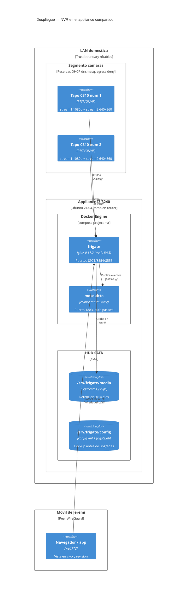
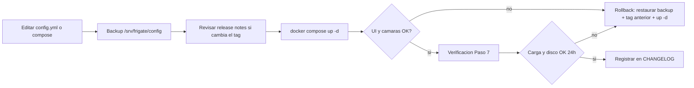
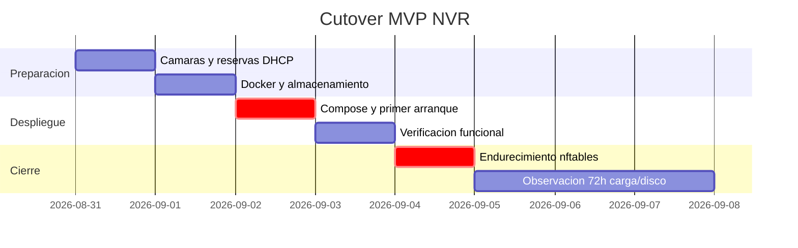

# Despliegue — NVR Doméstico Frigate (runbook paso a paso)

* **Estado:** ready — Gates 0 y 1 aprobados 2026-08-30; **ejecutable**. Pasa a `approved`
  al cerrar el Gate 4 con las desviaciones reales anotadas.
* **Fecha:** 2026-08-30
* **Decisores:** Jeremi
* **Fase AI-DLC:** 05-deployment
* **Versión:** 0.1.0
* **Gate:** 4
* **Entorno objetivo:** Appliance i3-3240, Ubuntu Server 24.04 LTS (host router)
* **Estrategia de release:** Despliegue manual deliberado, imagen pineada, rollback por tag

## Vista C4 — Deployment



---

## Paso 0 — Prerrequisitos y decisiones (HITL antes de ejecutar)
- [ ] IPs definitivas de las cámaras, fijadas por reserva DHCP. Van al `.env` como
      `FRIGATE_CAM1_IP` / `FRIGATE_CAM2_IP`: **no se escriben en el repo** (§Anonimización).
- [x] Capacidad medida 2026-09-08: **422 GB libres**. Con 5 días de continuo (~216 GB) más
      alertas, la ocupación queda en el 66 % del watermark del 90 %. ADR-0004 v1.1.
- [ ] Contraseñas listas: cuenta de cámara Tapo (una por cámara), usuario MQTT de Frigate y de Node-RED.
- [ ] Confirmar que el micrófono de las cámaras quedará deshabilitado (FL §934.03).
- [ ] IP LAN del appliance (`FRIGATE_LAN_IP`): es el bind de los puertos publicados **y**
      el candidate de WebRTC. Debe ser la IP que ven tanto la LAN como los peers WireGuard.

## Paso 1 — Configurar las cámaras Tapo C310 (ONVIF/RTSP local)
1. En la app Tapo, por cada cámara: **Configuración → Avanzado → Cuenta de cámara** →
   crear usuario/contraseña locales (esto habilita RTSP y ONVIF; no usar la cuenta TP-Link).
2. Desactivar el micrófono: **Configuración → Detección y alertas / Cámara → Micrófono → Off**.
3. Firmware al día desde la app (último parche antes de aislarlas de internet).
4. Reserva DHCP en dnsmasq del router (sustituir MACs reales):
   ```
   dhcp-host=<MAC-CAM-1>,<IP-CAM-1>,cam-01
   dhcp-host=<MAC-CAM-2>,<IP-CAM-2>,cam-02
   ```
   Reiniciar dnsmasq y reconectar las cámaras.
5. Verificación desde el appliance:
   ```bash
   source .env   # trae FRIGATE_CAM1_IP y las credenciales, sin teclearlas
   ffprobe -rtsp_transport tcp \n     "rtsp://$FRIGATE_RTSP_USER:$FRIGATE_RTSP_PASSWORD@$FRIGATE_CAM1_IP:554/stream1"
   ffprobe -rtsp_transport tcp \n     "rtsp://$FRIGATE_RTSP_USER:$FRIGATE_RTSP_PASSWORD@$FRIGATE_CAM1_IP:554/stream2"
   ```
   Debe reportar h264, 1920x1080 (stream1) y 640x360 (stream2).

## Paso 2 — Instalar Docker Engine + Compose
```bash
sudo apt-get update && sudo apt-get install -y ca-certificates curl
sudo install -m 0755 -d /etc/apt/keyrings
sudo curl -fsSL https://download.docker.com/linux/ubuntu/gpg -o /etc/apt/keyrings/docker.asc
echo "deb [arch=amd64 signed-by=/etc/apt/keyrings/docker.asc] \
  https://download.docker.com/linux/ubuntu noble stable" | \
  sudo tee /etc/apt/sources.list.d/docker.list
sudo apt-get update && sudo apt-get install -y docker-ce docker-ce-cli containerd.io \
  docker-buildx-plugin docker-compose-plugin
sudo usermod -aG docker jeremi   # re-login para aplicar
```
Nota router: Docker crea sus propias cadenas de iptables/nftables (`DOCKER-USER`). Tras
instalar, verificar que las reglas WAN del router siguen activas (`sudo nft list ruleset`)
antes de continuar. Los puertos publicados por Docker se controlan además desde la cadena
`DOCKER-USER` — la regla de cierre WAN va en el Paso 8.

## Paso 3 — Preparar almacenamiento y verificación VAAPI
```bash
sudo mkdir -p /srv/frigate/{config,media}
sudo apt-get install -y vainfo intel-gpu-tools
LIBVA_DRIVER_NAME=i965 vainfo   # debe listar perfiles H264 (VAEntrypointVLD)
```
Si `vainfo` no lista H264, instalar `i965-va-driver` en el host es irrelevante para el
contenedor (Frigate trae sus drivers), pero confirma que `/dev/dri/renderD128` existe.

## Paso 4 — Desplegar los archivos del proyecto
```bash
sudo mkdir -p /opt/nvr && cd /opt/nvr
# copiar deploy/docker-compose.yml, deploy/.env.example → .env, deploy/mosquitto/, deploy/frigate/
cp deploy/.env.example .env && chmod 600 .env && nano .env   # rellenar credenciales reales
cp deploy/frigate/config.yml /srv/frigate/config/config.yml
```
`config.yml` no lleva ninguna IP ni credencial: todo entra por variables `FRIGATE_*` desde
el `.env`. Lo único editable en el YAML son los nombres de cámara (`cam_01`, `cam_02`) y las
zonas. **Fijar los nombres antes del primer arranque**: renombrar una cámara después deja
huérfano su directorio de grabaciones, porque Frigate almacena la media por nombre.
`FRIGATE_LAN_IP` del `.env` alimenta dos cosas a la vez: el bind de los puertos en el
compose (T5) y `go2rtc.webrtc.candidates` en el config (RF04). Validar antes de arrancar:
```bash
docker compose config >/dev/null && echo compose-ok
```

## Paso 5 — Credenciales de Mosquitto
```bash
docker run --rm -v /opt/nvr/mosquitto:/mosquitto/config eclipse-mosquitto:2 \
  mosquitto_passwd -c -b /mosquitto/config/passwd frigate 'CLAVE_FRIGATE'
docker run --rm -v /opt/nvr/mosquitto:/mosquitto/config eclipse-mosquitto:2 \
  mosquitto_passwd -b /mosquitto/config/passwd nodered 'CLAVE_NODERED'
```

## Paso 6 — Arranque
```bash
cd /opt/nvr && docker compose up -d
docker compose logs -f frigate   # buscar la línea con la contraseña admin generada
```
Primer login: `https://IP-LAN:8971` con el usuario `admin` y la contraseña impresa en el
log (certificado autofirmado: aceptar). Cambiar la contraseña desde Settings → Users.

## Paso 7 — Verificación funcional y de carga
- UI: ambas cámaras con imagen en vivo; latencia observada ≤2 s.
- Grabación: aparecen segmentos en `/srv/frigate/media/frigate/recordings/`.
- Detección: caminar frente a una cámara → evento en la pestaña Review.
- MQTT: `docker exec -it mosquitto mosquitto_sub -u nodered -P 'CLAVE' -t 'frigate/#' -v`
  → debe fluir `frigate/available` y eventos.
- Carga (criterio T2, medir 15 min con detección activa):
  ```bash
  htop                       # frigate.detector + ffmpeg
  sudo intel_gpu_top         # confirma decodificación en la iGPU (Video engine > 0%)
  ```
  Presupuesto: <50 % CPU sostenida. Si se excede: bajar `detect.fps` a 4, o limitar el
  contenedor (`cpuset: "0,1"`) — decisión HITL de Gate 1.
- Audio (SR06 / FL §934.03): tomar un segmento recién grabado y comprobar que **no**
  tiene pista de audio —
  ```bash
  ffprobe -v error -show_streams -select_streams a \n    "$(find /srv/frigate/media/frigate/recordings -name '*.mp4' | head -1)" | grep -c codec_type
  ```
  Debe devolver `0`. (El default de Frigate es `preset-record-generic-audio-aac`; el
  config del proyecto lo fuerza a `preset-record-generic`.)
- Disco: `df -h /srv/frigate` y anotar crecimiento a las 24 h; alerta si >90 %.
- Logs: `docker inspect frigate --format '{{.HostConfig.LogConfig}}'` debe mostrar
  `max-size:10m` (T1: json-file sin rotación llena el disco del router).

## Paso 8 — Endurecimiento de red (traza T4/T5)
**Por qué el bind importa más que la regla.** Docker publica puertos con DNAT en
`PREROUTING`; el paquete termina en la ruta *forward*, no en `input`. Un `policy drop`
en la cadena `input` del router **no** protege un puerto publicado en `0.0.0.0`. Por eso
el compose bindea a `${FRIGATE_LAN_IP}` (control primario) y las reglas de abajo son la
segunda barrera. Verificar el bind real antes de nada:
```bash
sudo ss -lntup | grep -E '8971|8554|8555|1883'   # ninguna línea debe decir 0.0.0.0 o *
```

Pendiente de las MACs/IPs definitivas (mismo insumo que espera la config nftables del
router). Intención de reglas, a integrar en el ruleset del proyecto de red:
1. `DOCKER-USER` / input WAN: drop de 8971, 8554, 8555 y 1883 desde interfaces WAN.
2. Egress cámaras: drop de las IPs de ambas cámaras → WAN (opcional permitir NTP 123/udp);
   permitir solo cámara ↔ appliance en 554/2020.
3. Verificación externa: desde fuera (datos móviles), `nmap -Pn IP-WAN -p 8971,8554,8555,1883`
   → todo filtrado.

## Paso 8bis — Respaldo al NAS (ADR-0006)

El appliance **no monta nada**: la tarea la inicia el NAS. Los dos scripts y sus dos crons
están en `deploy/backup/` con su propio README; aquí solo el acceso desde el appliance.

**La base de datos se respalda aparte y por una razón**: `rsync` sobre una SQLite viva puede
dar un fichero roto, y una copia rota parece un respaldo hasta el día que la necesitas. Un
cron en el appliance ejecuta `snapshot-db.sh` (usa `sqlite3 .backup`, valida con
`integrity_check` y publica con un `mv` atómico) poco antes de que el NAS tire.

```bash
sudo useradd -r -m -s /bin/bash nvrbackup
sudo install -d -m 700 -o nvrbackup -g nvrbackup /home/nvrbackup/.ssh
# Pegar la clave publica del NAS restringida a rsync de solo lectura:
#   command="rrsync -ro /srv/frigate",no-agent-forwarding,no-port-forwarding,\n#   no-pty,no-X11-forwarding ssh-ed25519 AAAA...
sudo -u nvrbackup nano /home/nvrbackup/.ssh/authorized_keys
sudo chmod 600 /home/nvrbackup/.ssh/authorized_keys
# Lectura de la media sin poder escribir ni borrar:
sudo setfacl -R -m u:nvrbackup:rX /srv/frigate/config /srv/frigate/media/frigate/clips
```

En el NAS, tarea programada diaria que tire de `config/`, `clips/` y los exportados. **No
del continuo**: son 43 GB/día y replicarlo reintroduce el I/O de red que ADR-0006 descarta.

Verificar de verdad, no suponer (T-19): restaurar un archivo cualquiera desde el NAS y
reproducirlo. Un respaldo que nunca se ha restaurado no es un respaldo.

## Paso 9 — Pipeline de cambio y rollback



## Paso 10 — Plan de corte (gantt)



## Registro
Cada ejecución de este runbook se anota en `CHANGELOG.md` (`[Unreleased]` → versión al
cerrar Gate 4).
