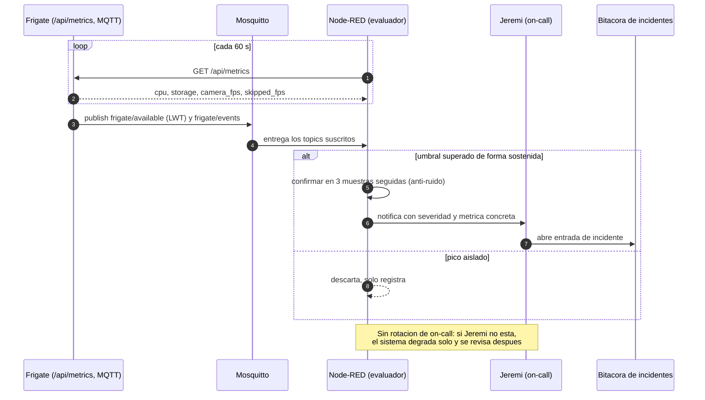
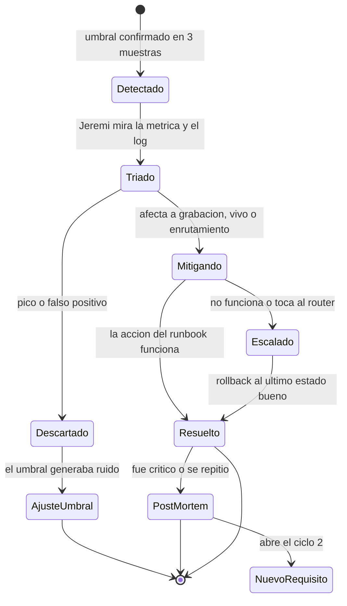
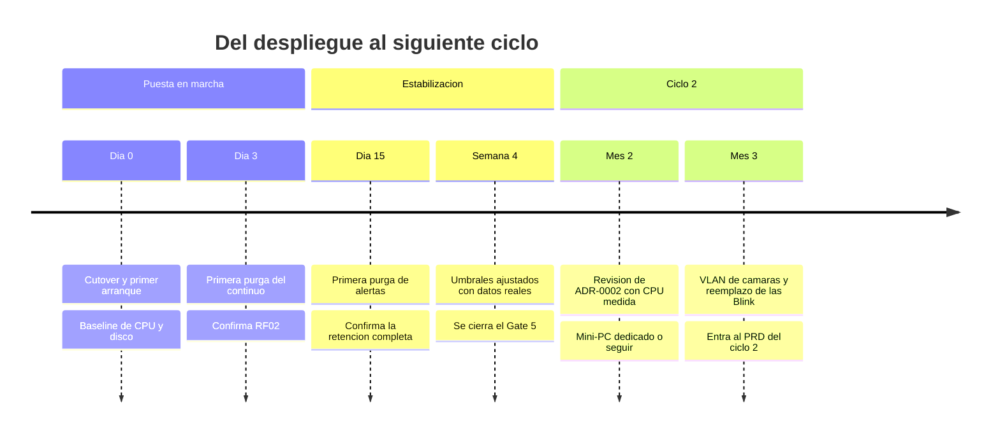

# Observabilidad y respuesta a incidentes — NVR Doméstico

* **Estado:** draft
* **Fecha:** 2026-08-30
* **Decisores:** Jeremi
* **Fase AI-DLC:** 06-monitoring
* **Versión:** 0.5.0
* **Gate:** 5
* **SLOs (ref):** métricas de éxito del charter y del PRD
* **On-call:** Jeremi (único operador; sin rotación)
* **ADRs relacionadas:** ADR-0002 (condición de reapertura), ADR-0008 (stack de observabilidad;
  supersede a ADR-0005)

## Principio: monitorizar lo que ya decidimos que importa

No se inventan métricas nuevas. Cada SLI de esta fase existe porque ya había un número
comprometido en el charter o una amenaza priorizada en el threat model. Si una métrica no
traza a ninguna de las dos cosas, no se recolecta.

Frigate 0.17 expone Prometheus en `/api/metrics`, y el host **ya ejecuta Prometheus, Grafana
y Alertmanager** (ADR-0008). Así que casi todos los SLIs salen de una sola fuente sin
instrumentación propia y sin desplegar nada nuevo: la especificación del job y de las reglas
está en `deploy/prometheus/`, y se instala en el proyecto que gobierna Prometheus.

Las métricas de host las aporta `node_exporter` (`deploy/prometheus/node-exporter.compose.yml`),
desplegado para este proyecto porque las dos preguntas que deciden si se sostiene —¿la CPU
sostenida degrada el enrutamiento (RNF01, ADR-0002)? ¿queda `MemAvailable` sobre 4 GB
(RNF03)?— **no se pueden responder desde Frigate**, que solo expone su propio proceso.

> Lo que sigue sin fuente de métrica: la **frescura del respaldo** al NAS (ADR-0006), cuyo
> `.last-success` vive en el NAS. Se resolvería con el mismo patrón de textfile servido por
> HTTP que el host ya usa para el job de throughput. No se escriben alertas que no puedan
> dispararse.

> **Advertencia de honestidad.** Los umbrales de abajo son los del charter, decididos antes
> de tener datos. Están marcados como *provisionales* hasta el baseline de 72 h del Gate 4;
> ese baseline es el que los confirma o los corrige. Un umbral que se ajusta con datos no es
> un fallo del plan, es el plan.

## SLIs, SLOs y de dónde sale cada número

| SLI | Fuente | SLO | Origen | Estado |
|---|---|---|---|---|
| Latencia de vista en vivo | Cronometrado (T-06/T-07) | ≤2 s en LAN y por WireGuard | Charter, RF04 | Fijo |
| CPU sostenida del NVR | `frigate_cpu_usage_percent` | <50 % sostenido | Charter, RNF01, T2 | **Provisional** |
| CPU sostenida del host | `rate(node_cpu_seconds_total{mode="idle"})` | <50 % sostenido. Es **esta** la que responde a ADR-0002: la pregunta era si el NVR degrada al router, no cuánto consume el NVR | ADR-0002 | **Provisional** |
| Frames descartados | `frigate_skipped_fps` | = 0 | T2 (canario del detector) | Fijo |
| Ocupación del media store | `frigate_storage_used_bytes / frigate_storage_total_bytes` | <90 % | Charter, T1 | Fijo |
| Memoria del contenedor Frigate | `frigate_mem_usage_percent` + `docker stats` | <80 % de su `mem_limit` de 3 GB | RNF03, T7 | Fijo |
| Memoria disponible del host | `node_memory_MemAvailable_bytes` | ≥4 GB con el NVR en marcha | RNF03, T7 | **Provisional** |
| Swap del host | `node_memory_Swap{Total,Free}_bytes` | 0 en régimen normal. **Aviso**: es swap del host, no atribuido al NVR; atribuir exige `docker stats` | RNF03 | Fijo |
| Disponibilidad por cámara | `frigate_camera_fps` > 0 y `frigate/available` | ≥99 % mensual | RF01 | **Provisional** |
| Retraso detección → MQTT | Marca de tiempo del evento contra la recepción | <3 s | PRD, RF05 | Fijo |
| Coste de inferencia | `frigate_detector_inference_speed_seconds` | Sin tendencia creciente | ADR-0001 (deuda del detector CPU) | Observar |
| Frescura del respaldo | Marca de tiempo del último rsync completado en el NAS | <36 h | ADR-0006, T8 | Fijo |
| Salud del enrutamiento | Latencia y pérdida de un ping a la WAN | Sin degradación contra el baseline pre-NVR | ADR-0002 | **Provisional** |

**Error budget.** Con uso doméstico no hay contrato que respetar, así que el presupuesto se
usa como disparador de decisión, no como castigo: si la disponibilidad de una cámara baja
del 99 % mensual (≈7 h), la causa se investiga antes de añadir cámaras nuevas. Si la CPU
supera el 50 % sostenido dos semanas seguidas, se reabre ADR-0002 — esa es su condición de
revisión escrita. Y si el NVR empieza a swapear, el presupuesto se considera agotado de
inmediato: swapear castiga al mismo HDD que está grabando, así que el síntoma se realimenta.

**La métrica que importa de verdad es la última.** Todo lo demás mide el NVR; esa mide el
daño colateral al router, que es el riesgo real de haber elegido un host compartido.

## De la señal a la persona

La confirmación en tres muestras no es un detalle: sin ella, un pico de CPU durante un
`apt upgrade` genera una alerta que enseña a ignorar las alertas.

## Puntos de recolección

El `C4Deployment` del sistema vive en `docs/05-deployment/deployment.md` y es único; aquí
solo se anota **dónde se engancha la telemetría** (regla anti-ruido: un objeto, un diagrama).

| Nodo del despliegue | Qué se recolecta | Cómo | Retención de la señal |
|---|---|---|---|
| Contenedor `frigate` | Métricas Prometheus | Scrape de Prometheus a `frigate:5000` por la red Docker compartida | La del TSDB de Prometheus |
| Contenedor `frigate` | Eventos y disponibilidad | MQTT `frigate/#` en el broker existente | Igual que los eventos |
| Contenedor `frigate` | Logins fallidos de la UI (A09) | `docker logs frigate` | 30 MB por rotación (3×10 MB) |
| Host / appliance | Salud del enrutamiento | **Ya cubierto**: los jobs de blackbox ICMP contra ambas WAN existían antes que este proyecto | La del TSDB |
| Host / appliance | CPU, carga, memoria, swap y sistemas de ficheros | `node_exporter` en red de host, raspado por Prometheus | La del TSDB |
| `/srv/frigate` | Ocupación, desde dos vantajes | `frigate_storage_*` y `node_filesystem_*` sobre `/`. **Si discrepan, algo está montado distinto de lo que la documentación asume** | La del TSDB |
| `/srv/frigate` | Ocupación | Métrica de storage; `df -h` como respaldo | Manual |

**Cómo se alcanza el 5000 sin publicarlo.** Frigate se une a la red Docker de la plataforma
(ADR-0008), donde ya viven el broker, Node-RED, Prometheus y Alertmanager. Prometheus raspa
`frigate:5000` por esa red. Así **ni el 5000 ni el 1883 se publican en ninguna interfaz**:
T6 pasa de "mitigado no publicando el puerto" a "no hay superficie que mitigar".

## Alertas

| Alerta | Condición | Severidad | Traza | Acción inmediata |
|---|---|---|---|---|
| Disco al 85 % | `frigate_storage_used_bytes / total > 0.85` durante 15 min | Media | T1 | Runbook I-2 |
| Disco al 92 % | Ídem >0.92 durante 5 min | **Crítica** | T1 | Runbook I-2 |
| Cámara caída | `camera_fps` = 0 durante 5 min, o `frigate/available` = offline | Alta | RF01 | Runbook I-1 |
| Detector saturado | `skipped_fps` > 0 en 3 muestras | Media | T2 | Runbook I-3 |
| CPU sostenida | >50 % durante 15 min | Media | RNF01, ADR-0002 | Runbook I-3 |
| Memoria del host baja | `MemAvailable` <1,5 GB en 3 muestras | Alta | RNF03, T7 | Runbook I-6 |
| Frigate cerca de su límite | `frigate_mem_usage_percent` >80 % en 3 muestras, o crecimiento monótono en 24 h | Media | RNF03, T7 | Runbook I-6 |
| Contenedor reiniciando | Uptime se reinicia más de 3 veces en 1 h. **Con `mem_limit`, un reinicio repetido suele ser OOM del contenedor**: confirmar con `docker inspect frigate --format '{{.State.OOMKilled}}'` | Alta | A10, T7 | Runbook I-4 |
| Memoria del host baja / crítica | `MemAvailable` <4 GB (15 min) / <1,5 GB (5 min) | Media / **Crítica** | RNF03, T7 | Runbook I-6 |
| Swap en uso | >256 MB durante 15 min | Media | RNF03 | Runbook I-6 |
| CPU del host sostenida | >50 % durante 15 min | Media | RNF01, ADR-0002 | Runbook I-3 |
| Raíz del host | <15 % libre (15 min) / <8 % libre (5 min) | Media / **Crítica** | T1 | Runbook I-2 |
| Respaldo obsoleto | Sin rsync completado en 36 h. **Sin fuente de métrica todavía** | Media | ADR-0006 | Runbook I-7 |
| Enrutamiento degradado | Pérdida o latencia anómala hacia la WAN | **Crítica** | ADR-0002 | Runbook I-5 |

Las reglas viven en `deploy/prometheus/frigate-rules.yml` y se enrutan por el Alertmanager
que ya existe, que ya sabe entregar a una persona. El Gate 5 deja de depender de construir
un notificador. Sigue en pie el criterio: una alerta que solo escribe en un log **no cumple
el Gate 5** — si nadie la ve, no es una alerta.

**Por qué el disco avisa al 85 % y no al 90 % del charter.** No hay volumen dedicado: `/srv`
comparte LV con la raíz del host, y el grupo de volúmenes no tiene espacio sin asignar para
tallar uno. Llenar el media store no degrada solo al NVR, sino a todo lo que corre en la
máquina. El control de T1 *"media en ruta dedicada"* no está disponible, así que el
watermark deja de ser una segunda barrera y pasa a ser la primera.

## Ciclo de vida de un incidente

`Descartado --> AjusteUmbral` es una transición de primera clase a propósito: en un sistema
de un solo operador, el modo de fallo más probable no es que falle el NVR, es que las
alertas se vuelvan ruido y se dejen de mirar.

## Runbooks de incidente

**I-1 · Cámara caída.** Ping a la IP de la cámara. Si responde: `docker compose restart
frigate` y revisar el log en busca de errores de RTSP. Si no responde: comprobar la reserva
DHCP en dnsmasq (¿cambió la IP?) y la alimentación. Causa frecuente: la cámara perdió el
Wi-Fi o la app Tapo aplicó una actualización de firmware que reseteó la cuenta local.

**I-2 · Disco casi lleno.** Confirmar con `df -h /srv/frigate`. Verificar que la purga está
funcionando: `find /srv/frigate/media/frigate/recordings -mtime +3 | head`. Si aparecen
archivos más viejos que la retención, la purga está fallando (revisar el log de Frigate). Si
la purga funciona y aun así se llena, el dimensionado quedó corto: bajar la retención
continua o mover el media store a un disco mayor. **No borrar a mano** salvo emergencia: la
base de datos quedaría desincronizada de los archivos.

**I-3 · Detector saturado o CPU alta.** Primero **atribuir**, que ahora se puede: comparar la
CPU del host (`node_cpu_seconds_total`) con la de Frigate (`frigate_cpu_usage_percent`). Si
el host está alto y Frigate no, el NVR es la víctima y no la causa, y tocar `detect.fps` no
arregla nada. Confirmado que es el NVR, palancas en este orden: (1) `detect.fps` de 5 a 4;
(2) `cpuset: "0,1"` en el compose para dejarle núcleos libres al enrutamiento; (3) reducir
objetos rastreados (quitar `cat`/`dog`, que sirven de poco y cuestan igual); (4) si nada
basta, reabrir ADR-0002 hacia un mini-PC dedicado. Registrar qué palanca se usó: es la
evidencia con la que se decide el ciclo 2.

**I-4 · Contenedor en crash-loop.** `docker compose logs --tail 200 frigate`. Si es un error
de validación de config, restaurar el backup de `/srv/frigate/config` y aplicar el flujo del
§9 del runbook. Si empezó tras una subida de versión, hacer rollback al tag anterior — para
eso está pineado.

**I-6 · Presión de memoria.** Primero separar quién la consume: `docker stats --no-stream`
contra `free -h`. Si el contenedor está cerca de sus 3 GB, mirar de dónde sale — el `tmpfs`
cuenta dentro del límite, así que `docker exec frigate df -h /tmp/cache` es la comprobación
clave. **Si el tmpfs está lleno, el problema real es el disco, no la memoria**: la caché no
puede drenar al HDD y crece hacia su techo (acoplamiento T1→T7); ir al runbook I-2 y volver.
Si el tmpfs está vacío y el RSS sube solo, es una fuga: reiniciar el contenedor recupera el
servicio y anotar el episodio, porque sin historial de métricas (ADR-0005) una fuga lenta
solo se ve por acumulación de episodios. Si quien consume es el host y no el NVR, el NVR es
la víctima y no la causa. Lo que **no** hay que hacer es subir el `mem_limit` para que deje
de avisar: ese límite es lo que impide que el OOM killer se lleve a `dnsmasq` por delante.

**I-7 · Respaldo obsoleto.** El respaldo lo inicia el NAS, así que el fallo casi siempre está
allí: tarea desactivada, disco lleno o clave SSH caducada. Comprobar desde el NAS primero.
Si el NAS está bien, verificar en el appliance que `nvrbackup` sigue existiendo y que la ACL
de lectura no se perdió tras un cambio de permisos. **Esta alerta es de las que más importan
aunque parezca menor**: un respaldo que dejó de correr en silencio es peor que no tenerlo,
porque da una red de seguridad que no existe. No silenciarla sin arreglar la causa.

**I-5 · Enrutamiento degradado (crítica).** El router manda sobre el NVR, siempre.
`docker compose stop` para devolverle la máquina al enrutamiento, confirmar que se recupera,
y solo entonces investigar. Si parar el NVR arregla el enrutamiento, ADR-0002 queda invalidada
de facto y la decisión del mini-PC pasa a ser urgente, no diferida.

## Hitos y bucle hacia el ciclo 2

Según AI-DLC, los hallazgos de esta fase no se quedan aquí: abren el siguiente ciclo de
requisitos actualizando **primero el C4 Context** y propagando hacia abajo. Los candidatos ya
identificados son la reapertura de ADR-0002, la VLAN de cámaras (mitigación pendiente de T3)
y el reemplazo de las Blink Mini, hoy en no-scope explícito.
