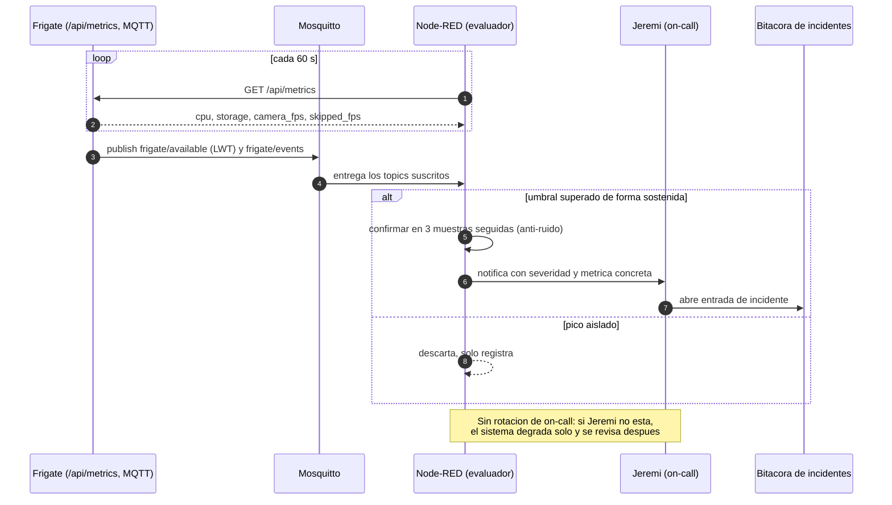
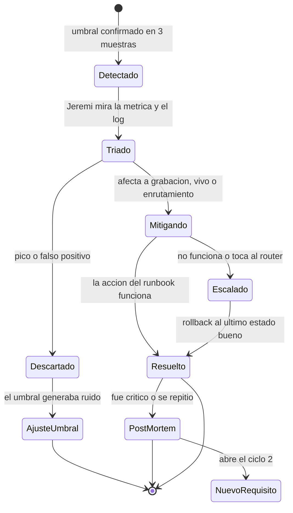
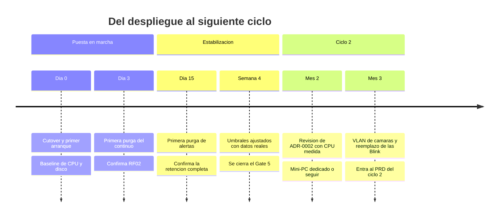

# Observabilidad y respuesta a incidentes — NVR Doméstico

* **Estado:** draft
* **Fecha:** 2026-08-30
* **Decisores:** Jeremi
* **Fase AI-DLC:** 06-monitoring
* **Versión:** 0.5.0
* **Gate:** 5
* **SLOs (ref):** métricas de éxito del charter y del PRD
* **On-call:** Jeremi (único operador; sin rotación)
* **ADRs relacionadas:** ADR-0002 (condición de reapertura), ADR-0005 (stack de observabilidad)

## Principio: monitorizar lo que ya decidimos que importa

No se inventan métricas nuevas. Cada SLI de esta fase existe porque ya había un número
comprometido en el charter o una amenaza priorizada en el threat model. Si una métrica no
traza a ninguna de las dos cosas, no se recolecta.

Frigate 0.17 expone Prometheus en `/api/metrics`, así que casi todos los SLIs salen de una
sola fuente sin instrumentación propia.

> **Advertencia de honestidad.** Los umbrales de abajo son los del charter, decididos antes
> de tener datos. Están marcados como *provisionales* hasta el baseline de 72 h del Gate 4;
> ese baseline es el que los confirma o los corrige. Un umbral que se ajusta con datos no es
> un fallo del plan, es el plan.

## SLIs, SLOs y de dónde sale cada número

| SLI | Fuente | SLO | Origen | Estado |
|---|---|---|---|---|
| Latencia de vista en vivo | Cronometrado (T-06/T-07) | ≤2 s en LAN y por WireGuard | Charter, RF04 | Fijo |
| CPU sostenida del NVR | `frigate_cpu_usage_percent` + `docker stats` | <50 % sostenido | Charter, RNF01, T2 | **Provisional** |
| Frames descartados | `frigate_skipped_fps` | = 0 | T2 (canario del detector) | Fijo |
| Ocupación del media store | `frigate_storage_used_bytes / frigate_storage_total_bytes` | <90 % | Charter, T1 | Fijo |
| Disponibilidad por cámara | `frigate_camera_fps` > 0 y `frigate/available` | ≥99 % mensual | RF01 | **Provisional** |
| Retraso detección → MQTT | Marca de tiempo del evento contra la recepción | <3 s | PRD, RF05 | Fijo |
| Coste de inferencia | `frigate_detector_inference_speed_seconds` | Sin tendencia creciente | ADR-0001 (deuda del detector CPU) | Observar |
| Salud del enrutamiento | Latencia y pérdida de un ping a la WAN | Sin degradación contra el baseline pre-NVR | ADR-0002 | **Provisional** |

**Error budget.** Con uso doméstico no hay contrato que respetar, así que el presupuesto se
usa como disparador de decisión, no como castigo: si la disponibilidad de una cámara baja
del 99 % mensual (≈7 h), la causa se investiga antes de añadir cámaras nuevas. Si la CPU
supera el 50 % sostenido dos semanas seguidas, se reabre ADR-0002 — esa es su condición de
revisión escrita.

**La métrica que importa de verdad es la última.** Todo lo demás mide el NVR; esa mide el
daño colateral al router, que es el riesgo real de haber elegido un host compartido.

## De la señal a la persona

La confirmación en tres muestras no es un detalle: sin ella, un pico de CPU durante un
`apt upgrade` genera una alerta que enseña a ignorar las alertas.

## Puntos de recolección

El `C4Deployment` del sistema vive en `docs/05-deployment/deployment.md` y es único; aquí
solo se anota **dónde se engancha la telemetría** (regla anti-ruido: un objeto, un diagrama).

| Nodo del despliegue | Qué se recolecta | Cómo | Retención de la señal |
|---|---|---|---|
| Contenedor `frigate` | Métricas Prometheus | `GET :5000/api/metrics` | En memoria de Node-RED, ventana de 24 h |
| Contenedor `frigate` | Eventos y disponibilidad | MQTT `frigate/#` | Igual que los eventos |
| Contenedor `frigate` | Logins fallidos de la UI (A09) | `docker logs frigate` | 30 MB por rotación (3×10 MB) |
| Host / appliance | CPU, carga, salud del enrutamiento | `htop`, ping a la WAN | Manual |
| `/srv/frigate` | Ocupación | Métrica de storage; `df -h` como respaldo | Manual |

**Detalle de despliegue que hay que resolver, no descubrir.** `/api/metrics` está en el
puerto **5000**, que deliberadamente no se publica (T6). Node-RED solo puede leerlo si se
conecta a la red interna de Docker (`docker network connect nvr_default node-red`, o mover
Node-RED al mismo proyecto compose). **No** se resuelve publicando el 5000: eso reabriría T6,
porque ese puerto no tiene autenticación.

## Alertas

| Alerta | Condición | Severidad | Traza | Acción inmediata |
|---|---|---|---|---|
| Disco casi lleno | Ocupación >90 % en 3 muestras | Alta | T1 | Runbook I-2 |
| Cámara caída | `camera_fps` = 0 durante 5 min, o `frigate/available` = offline | Alta | RF01 | Runbook I-1 |
| Detector saturado | `skipped_fps` > 0 en 3 muestras | Media | T2 | Runbook I-3 |
| CPU sostenida | >50 % durante 15 min | Media | RNF01, ADR-0002 | Runbook I-3 |
| Contenedor reiniciando | Uptime se reinicia más de 3 veces en 1 h | Alta | A10 | Runbook I-4 |
| Enrutamiento degradado | Pérdida o latencia anómala hacia la WAN | **Crítica** | ADR-0002 | Runbook I-5 |

Destino de las notificaciones: el que ya use el stack Node-RED existente. Una alerta que solo
escribe en un log **no cumple el Gate 5**: si nadie la ve, no es una alerta.

## Ciclo de vida de un incidente

`Descartado --> AjusteUmbral` es una transición de primera clase a propósito: en un sistema
de un solo operador, el modo de fallo más probable no es que falle el NVR, es que las
alertas se vuelvan ruido y se dejen de mirar.

## Runbooks de incidente

**I-1 · Cámara caída.** Ping a la IP de la cámara. Si responde: `docker compose restart
frigate` y revisar el log en busca de errores de RTSP. Si no responde: comprobar la reserva
DHCP en dnsmasq (¿cambió la IP?) y la alimentación. Causa frecuente: la cámara perdió el
Wi-Fi o la app Tapo aplicó una actualización de firmware que reseteó la cuenta local.

**I-2 · Disco casi lleno.** Confirmar con `df -h /srv/frigate`. Verificar que la purga está
funcionando: `find /srv/frigate/media/frigate/recordings -mtime +3 | head`. Si aparecen
archivos más viejos que la retención, la purga está fallando (revisar el log de Frigate). Si
la purga funciona y aun así se llena, el dimensionado quedó corto: bajar la retención
continua o mover el media store a un disco mayor. **No borrar a mano** salvo emergencia: la
base de datos quedaría desincronizada de los archivos.

**I-3 · Detector saturado o CPU alta.** Palancas en este orden: (1) `detect.fps` de 5 a 4;
(2) `cpuset: "0,1"` en el compose para dejarle núcleos libres al enrutamiento; (3) reducir
objetos rastreados (quitar `cat`/`dog`, que sirven de poco y cuestan igual); (4) si nada
basta, reabrir ADR-0002 hacia un mini-PC dedicado. Registrar qué palanca se usó: es la
evidencia con la que se decide el ciclo 2.

**I-4 · Contenedor en crash-loop.** `docker compose logs --tail 200 frigate`. Si es un error
de validación de config, restaurar el backup de `/srv/frigate/config` y aplicar el flujo del
§9 del runbook. Si empezó tras una subida de versión, hacer rollback al tag anterior — para
eso está pineado.

**I-5 · Enrutamiento degradado (crítica).** El router manda sobre el NVR, siempre.
`docker compose stop` para devolverle la máquina al enrutamiento, confirmar que se recupera,
y solo entonces investigar. Si parar el NVR arregla el enrutamiento, ADR-0002 queda invalidada
de facto y la decisión del mini-PC pasa a ser urgente, no diferida.

## Hitos y bucle hacia el ciclo 2

Según AI-DLC, los hallazgos de esta fase no se quedan aquí: abren el siguiente ciclo de
requisitos actualizando **primero el C4 Context** y propagando hacia abajo. Los candidatos ya
identificados son la reapertura de ADR-0002, la VLAN de cámaras (mitigación pendiente de T3)
y el reemplazo de las Blink Mini, hoy en no-scope explícito.
